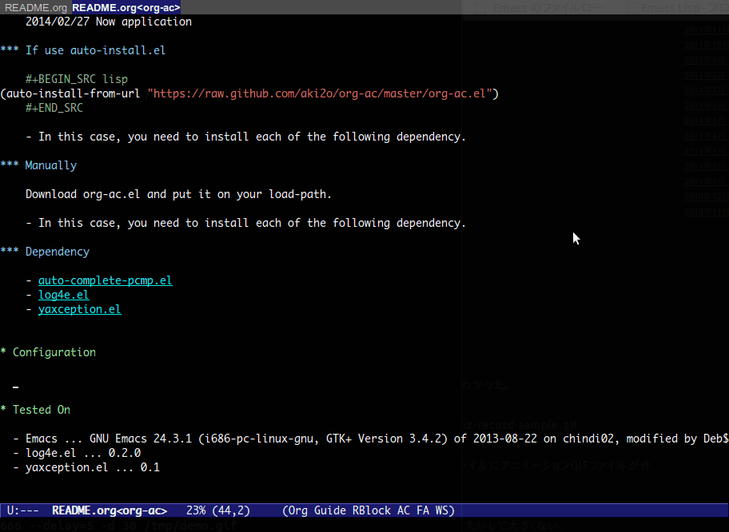

# これは何？

org-modeでauto-complete.elの補完を提供するEmacsの拡張です。  
M-TABによる補完機能をauto-complete.elのインタフェースで利用できるようになります。  

# デモ



# インストール

### package.elを使う場合

2014/03/02 melpaリポジトリからインストール可能

### el-get.elを使う場合

2014/02/28 登録申請中

### auto-install.elを使う場合

```lisp
(auto-install-from-url "https://raw.github.com/aki2o/org-ac/master/org-ac.el")
```
-   下記の依存拡張もそれぞれインストールする必要があります

### 手動の場合

org-ac.elをダウンロードし、load-pathの通った場所に配置して下さい。
-   下記の依存拡張もそれぞれインストールする必要があります

### 依存拡張

-   
-   
-   

# 設定

```lisp
(require 'org-ac)

;; Make config suit for you. About the config item, eval the following sexp.
;; (customize-group "org-ac")

(org-ac/config-default)
```

# 動作確認

-   Emacs &#x2026; GNU Emacs 24.3.1 (i686-pc-linux-gnu, GTK+ Version 3.4.2) of 2013-08-22 on chindi02, modified by Debian
-   auto-complete-pcmp.el &#x2026; 0.0.1
-   log4e.el &#x2026; 0.2.0
-   yaxception.el &#x2026; 0.1

**Enjoy!!!**
